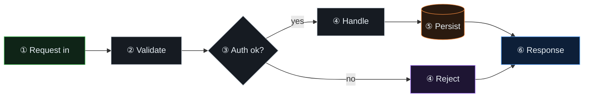
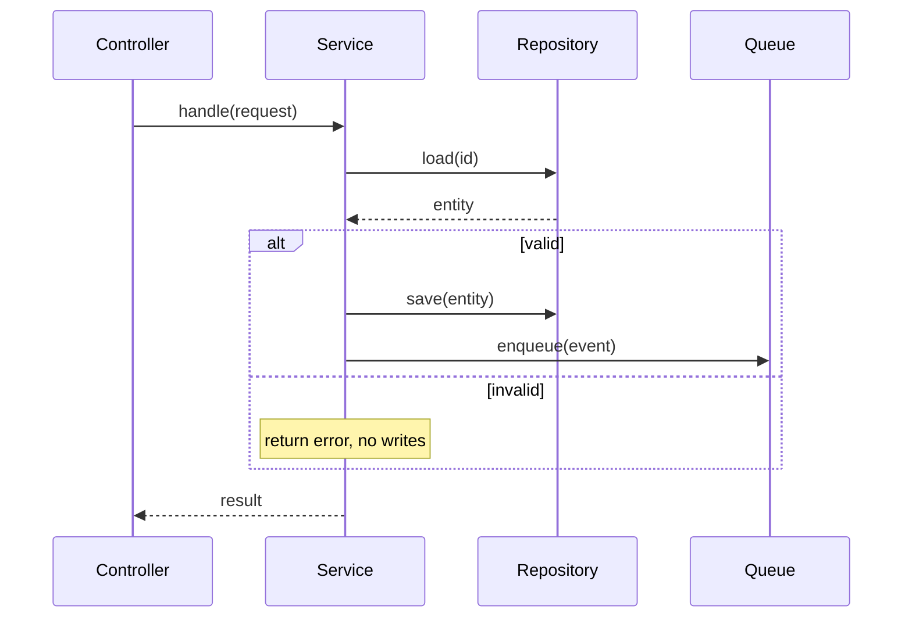
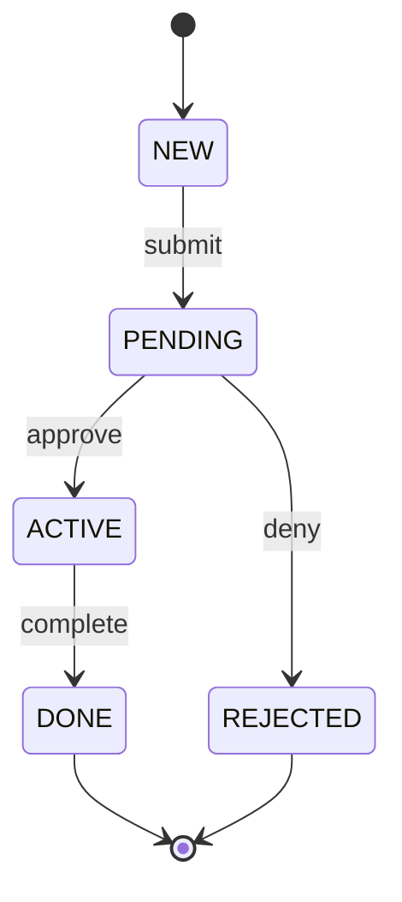

# Static & portable diagrams — Mermaid + ASCII

The portable tier: diagrams that embed in PRs, wikis, tickets, and chat with no
JS. Covers Mermaid (flowchart / sequence / stateDiagram / data-flow) and ASCII.
These are often the CORRECT answer — cheap, diffable, universally rendered.

The examples below use a generic request/order pipeline purely as a stand-in.
Swap the node labels, edges, states, and messages for the subject you are
explaining — the STRUCTURE and house style are the reusable part, not the words.

## Table of contents
- House style (colour-by-role, legend, altitude)
- Flowchart (control/data flow)
- Data-flow diagram (DFD: sources/processes/stores/sinks)
- Sequence (who calls whom, in order)
- State diagram (states + transitions)
- ASCII patterns (chat tier)
- Dual-lens in Mermaid (before/after, mode A/mode B)

## House style (apply to every Mermaid diagram)

1. **Colour by ROLE, not decoration.** Same colour = same function. Define
   `classDef`s for the roles in play and assign them. Pick role names that fit
   the subject; a common neutral set: input (green), process (grey), store
   (orange), external/sink (blue), variant/alt-path (purple).
2. **Legend under every coloured diagram.** One line mapping colour → role.
3. **Altitude matches the ask.** Super-high-level (a few boxes) vs mid vs
   detailed — do not render 30 nodes when the question is "roughly how does
   this flow".
4. **Direction:** `LR` for pipelines/flows, `TB` for hierarchies/trees.

Reusable classDefs (paste + assign; rename roles to fit the subject):

```
classDef input   fill:#0f2417,stroke:#3fb950,color:#e6edf3;
classDef process fill:#161b22,stroke:#c9d1d9,color:#e6edf3;
classDef store   fill:#2a1a0f,stroke:#f0883e,color:#e6edf3;
classDef sink    fill:#0d1f38,stroke:#58a6ff,color:#e6edf3;
classDef variant fill:#1e1533,stroke:#a371f7,color:#e6edf3;
```

## Flowchart (control / data flow)

Best for the lifecycle-spine and general "how does X flow" at the mermaid tier.


Legend: green=input · grey=process · orange=store · blue=response · purple=alt path.

## Data-flow diagram (DFD)

The "good old" node-edge diagram. Distinguish the four DFD roles by shape +
colour: external source/sink (stadium `([ ])`), process (rounded `( )`), data
store (cylinder `[( )]`). Label EDGES with the data that flows.


Legend: stadium=external · rounded=process · cylinder=store. Edge labels = data.

## Sequence (who calls whom, in order)

The mermaid form of collaborator-swimlanes. Use `alt`/`opt` for forks. Use
`Note over` to mark a variant path or an important side effect.


For two modes (before/after, prod/test), either two diagrams side by side, or
`Note over` callouts marking which messages differ between the modes.

## State diagram (states + transitions)

The mermaid form of state-machine. Label transitions with their trigger.


For a mode where transitions are simulated (e.g. a dry-run / preview), annotate
in surrounding prose or a `note` that the same path is computed without
committing the state change.

## ASCII patterns (chat tier)

For the cheapest tier, in-conversation. Keep indentation inside the fence.

Spine / flow:
```
① request → ② validate → ③ auth? ─┬─ ok ───→ ④ handle → ⑤ persist ─┐
                                   └─ fail ─→ ④ reject ─────────────┴→ ⑥ response
```

Before/after (change):
```
BEFORE                          AFTER
handle(req) -> None             handle(req) -> Result
  writes, returns nothing         same writes, returns a Result object
                                caller can now inspect the outcome
```

Call tree:
```
Controller.handle(req)
├─ Service.validate(req)      guard clause
│   └─ Rules.check(...)
├─ Repository.save(entity)    the write
└─ Queue.enqueue(event)       side effect
```

Provenance (one value):
```
userId:  born → AuthMiddleware (decoded from token)
         read → Controller: request.user.id
         used → Repository.save(ownerId=userId), audit log
```

## Dual-lens in Mermaid

Two fenced blocks labelled BEFORE/AFTER (or MODE A / MODE B), same node layout
so the reader diffs by position. Keep node ids identical across both so the eye
tracks what changed. Recolour only the nodes that flip between the two lenses.
