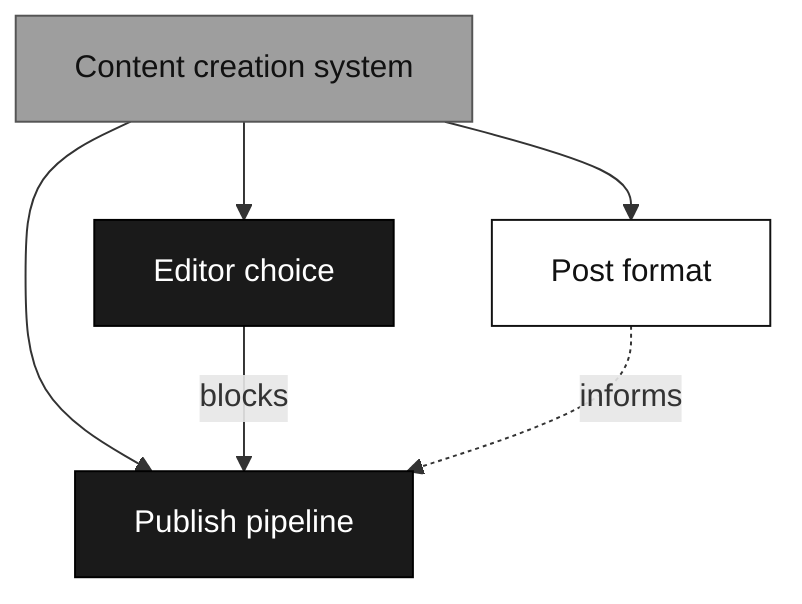

# Whitebox

Whiteboxing turns one opaque idea into a graph of small, decidable pieces. Systems view: every system is a composition of subsystems, each with inputs and outputs. A fresh idea is a system nobody has decomposed yet: a single black box. The process opens it box by box until every box is white and the route from idea to action is visible.

The output is decisions, not deliverables. The moment you feel the pull to start building, you have reached the edge of the map: box what remains, do not build.

## When to use

- Decisions must outlive the conversation: interruption, resume, handoff, or a why-record worth auditing later.
- Open unknowns outnumber what you can hold in your head, and nobody has enumerated them.
- Several sessions (or people) need to share one picture of what is decided so far.

Size is a signal, not the criterion: small-but-gnarly work deserves a map, large-but-obvious work may not. If charting surfaces no unknowns, or the decisions can safely live and die with the conversation, say so and skip the map.

## Vocabulary

- **Mission**: the product goal, why the effort exists. "Build a content creation system."
- **Destination**: what ends this map: a spec ready to hand off, a decision locked, a change made in place. The stop condition. Without it the process cannot tell planning from building.
- **Box**: one record holding one question whose resolution is a decision or a fact.
- **States**: **black** = boundary named, interior unexplored. **grey** = opened: partly decided, decomposed, or drafted and under review. **white** = own decision final AND every child white. A box's state lives in its record's frontmatter; a parent's state is computed from its children, never set by hand.
- **Edges**: declared in box-record frontmatter, rendered in the diagram. Decomposition = the child's `parent` field. `blocks` = hard dependency: the target cannot be decided until this box is white. `informs` (dotted in the diagram) = this box's answer shapes the target without gating it.
- **Frontier**: boxes that are not white and not blocked. A query over frontmatter: `state != white` and every box that lists this one in `blocks` is white.
- **Open unknowns**: questions you can feel but cannot yet state precisely. They live inside the box they belong to, worst case the root box, never in a global list. Test: can the question be phrased sharply right now? Sharp = its own box, even if blocked. Vague = open unknown. The map is deliberately incomplete: never pre-slice an open unknown into box-sized pieces. An unknown is coarser than a box; once whitening reaches it, it may sharpen into several boxes, or none.
- **Out of scope**: ruled past the destination. Closed with a one-line reason, never worked on this map.

## The map

One map per effort. The map is a low-resolution index: it names boxes, shows states and edges, and gists finished decisions. Detail lives in exactly one place, the box record; the map links, never restates.

```markdown
# <effort name>

## Mission
<1-2 lines>

## Destination
<1-2 lines: the artifact or decision that ends this map>

## Notes
<domain vocabulary, standing preferences, store config, recorded assumptions>

## Map
<mermaid DAG, see below>

## Decisions so far
- [<box name>](<link>): <one-line gist of the decision>

## Heading
<1-2 lines: where the effort points next; sharpest open unknowns gisted from their boxes, links only>

## Out of scope
- [<box name>](<link>): <gist + why it is past the destination>
```

Topology and state live in box-record frontmatter: one `state` field and explicit edge lists per box. The mermaid block is a derived view: regenerated from frontmatter, never edited by hand. If diagram and frontmatter disagree, frontmatter wins. Never read state, edges, or the frontier off the diagram: queries run over frontmatter; the diagram is for the operator's eyes.



Every node carries exactly one classDef (`black`/`grey`/`white`) and a `click` link to its record, all read from frontmatter at regeneration time. A state flip is an edit to one frontmatter field; the diagram follows on the next regeneration.

**Regenerating** = rewriting the mermaid block from all box records: one node per record, decomposition arrows from `parent` fields, `blocks`/`informs` edges from those lists, classDefs from `state`. Recompute parent states bottom-up first (hard rule 5), then render. Regenerate at sync points: on map load (resume), before showing the map to the operator, at any clean break. Between sync points the diagram may lag; harmless, since state is never read from it.

## Box records

One record per box. Name it after the question's subject, kebab-case for files.

```markdown
---
state: black | grey | white
method: dialogue | research | prototype | task | adr
parent: <box>            # decomposition edge; root omits
blocks: [<box>, ...]     # hard: targets cannot be decided until this box is white
informs: [<box>, ...]    # soft: this answer shapes targets without gating them
---
# <box name>

## Question
<the one decision or investigation this box holds>

## Decision
<empty until made; then the answer and the why>

## Open unknowns
<felt-but-not-sharp questions living inside this box>

## Links
<assets: research notes, prototypes, ADR/spec documents. Link, never paste>
```

Methods say what whitening means for this box:

| Method | Mode | White when |
|---|---|---|
| dialogue | with operator | question answered through Socratic questioning, one question at a time (default) |
| research | agent alone | fact surfaced from docs, APIs, or code; findings linked |
| prototype | with operator | throwaway artifact built, reacted to, decision taken |
| task | either | prerequisite work done (access provisioned, data moved); resulting facts recorded |
| adr | with operator | decision record accepted. Grey while drafted or under review |

## Hard rules

1. **Write-through-box.** Persist at the moment clarity lands or a new unknown appears, not at session end. Decision goes to the box record, state flip to its frontmatter, gist to the map, new boxes wired in, invalidated boxes rewritten or ruled out. The diagram catches up at the next sync point. The map never lags the conversation.
2. **Operator-side boxes wait for the operator.** dialogue, prototype, and adr boxes resolve only through the live exchange. Never answer for them; if the operator is away, the box stays open with the pending question recorded.
3. **Never assume a non-functional requirement silently.** Scale, latency, availability, security, cost, compliance, operability: each dimension the effort touches becomes an answered question, its own box, or an assumption written in Notes where the operator will see it. Dimensions the effort does not touch are skipped, not padded.
4. **Decide, don't build.** Wanting to implement is the signal the map has reached its edge.
5. **Parent state is computed.** A parent goes white only when its own decision is final and every child is white. Recompute parent states from frontmatter at every diagram regeneration; never set by hand.
6. **The map points, never duplicates.** Full answers live in box records and linked assets.
7. **Contradiction reopens.** When a new decision contradicts a white box, flip it back to grey, record the contradiction in its record, and re-examine every box it blocks or informs. Whiteness is never grandfathered.

## Charting: loose idea to first map

Charting touches the disk only at step 5. No map, no boxes, no provisional skeletons before the operator picks the store; until then, pending state lives in the conversation.

1. Pin **Mission** and **Destination** through questioning, one question at a time. Destination first defines scope; everything else hangs on it.
2. Fix the domain language as terms come up (see Fallbacks: domain modeling). Entities, relationships, and levels in the domain's own words, never in implementation terms.
3. If the effort designs or changes a system, sweep the non-functional dimensions (hard rule 3). A map for prose or curriculum may have none; skip freely.
4. Sweep the space **breadth-first** for boxes: fan wide, do not dive deep on any thread. If no unknowns surface, the way is already clear: say so and skip the map.
5. Ask the operator where the map should live (see Choosing the store). Create the map and its box records, then wire edges in a second pass by filling `parent`/`blocks`/`informs` frontmatter, since boxes need identities before they can reference each other. Regenerate the diagram once wiring is done.
6. Dispatch research boxes to subagents in parallel; link findings as they return.

Charting ends with a persisted map. Continue into Working in the same session only if the operator wants to.

## Working: whiten box by box

1. The operator points at a map (path or URL). Regenerate the diagram from frontmatter before anything else: resume trusts records, not a possibly stale picture. Then work from the map, opening box records only as the work needs them. The map plus its boxes are the entire state; the previous conversation is not needed.
2. Pick a frontier box. The operator's pick wins; otherwise take the topmost unblocked box.
3. Whiten it through its method. Zoom into related records on demand.
4. Apply write-through-box after every increment of clarity (hard rule 1).
5. Whitening sharpens unknowns: re-check the open unknowns in this box and its neighbours; any question now phrasable sharply becomes its own box, wired in via write-through.
6. A box revealed to sit past the destination gets closed and gisted under Out of scope with the reason. It is a scope boundary, not a decision, so it stays out of Decisions so far.
7. Repeat or stop. Any point is a clean break: the next session resumes from the map alone.

## Choosing the store

The model above is store-agnostic. Ask the operator where records live before creating anything, and write the choice into Notes. A whitebox map is work-in-progress material, like an RFC draft: it may deliberately not belong in the repo it concerns.

| Store | Map | Boxes | Fits when |
|---|---|---|---|
| markdown directory (reference store) | `<dir>/<slug>/map.md` | `<dir>/<slug>/boxes/*.md` | default. `<dir>` may be an in-repo knowledge path, or outside the repo entirely (`~/whitebox/`, `/tmp/`) when WIP must not touch version control |
| issue tracker | parent issue or epic, mermaid block in its body | child issues, one per box | the team already lives in the tracker; native blocking shows the frontier in the tracker UI; frontmatter fields become labels and issue relations, states become labels |

Never assume the store, and never scatter files into a repo uninvited. Real outputs the boxes point at (ADRs, specs, tickets) go wherever the operator's systems keep them; the map only links.

## Fallbacks

The skill is self-sufficient. For each capability below: if a matching skill is registered, invoke it; otherwise the embedded guidance is enough.

- **Domain modeling**: keep one name per concept and challenge collisions the moment they appear. Separate domain-level language (what the business means) from application-level language (what the software does). Model entities and their relationships, never implementation details. When a decision is hard to reverse, surprising to a future reader, and the product of a real trade-off, record it as an ADR; all three or it is not one.
- **Questioning**: Socratic, one question at a time.
- **Prototyping**: build the cheapest throwaway artifact that makes the question concrete (outline, stub, mock, script), react to it, decide, discard.
- **Research**: dispatch a subagent to read the docs, APIs, or code and return facts; link findings from the box.

## Common mistakes

| Mistake | Fix |
|---|---|
| Building the thing mid-map | Edge of the map reached: box what remains, stop building |
| Assuming scale, latency, security, budget silently | Ask, box it, or write the assumption in Notes |
| Updating the map at session end | Write-through-box: persist at the moment of clarity |
| Answering a dialogue box for the operator | Record the pending question; the box waits |
| Pasting research or full decisions into the map | Map gists and links; content lives in the box record |
| Hand-flipping a parent white | Parents whiten themselves when children do |
| Editing the mermaid block by hand | Frontmatter is truth: edit it, regenerate the diagram |
| Reading state or the frontier off the diagram | Queries run over frontmatter; diagram is operator-facing only |
| Contradicted white box stays white | Flip it grey, walk its blocks/informs targets (hard rule 7) |
| Boxing a vague hunch | Cannot state it sharply = open unknown inside the nearest box |
| Pre-slicing an open unknown into box-sized pieces | An unknown becomes boxes only when sharp; it may yield several, or none |
| Depth-diving one thread while charting | Charting is breadth; depth belongs to Working |
| Choosing where files go by yourself | The operator picks the store, always; nothing is written before that choice, not even in a scratch dir |
